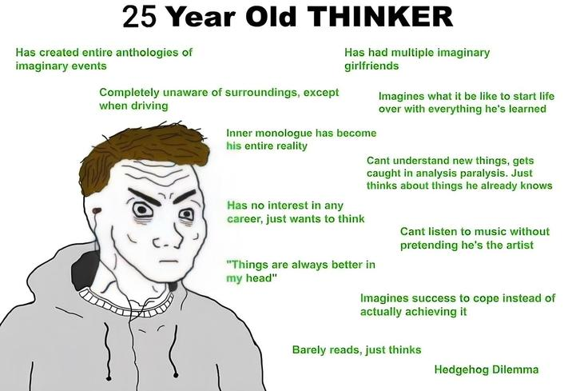

+++
title = "I Decided to Build a Blog (Again)"
date = "2025-12-08T19:26:33-05:00"
#dateFormat = "2006-01-02" # This value can be configured for per-post date formatting
author = "25-year-old thinker"
authorTwitter = "" #do not include @
cover = ""
tags = ["english", "blogging"]
keywords = ["", ""]
description = "Try blogging again just right before the new year. Wish I could stick to it this time."
showFullContent = false
readingTime = true
hideComments = false
draft = false
+++

I like reading posts online and web development, and personal blog combines the best of the both worlds. I have tried to build a personal blog in the past, but I didn't stick to them in the end. I either got too busy with life or just lose passion. This year I started going to therapy, and journaling is a good way for me to put my abstract chaotic thoughts into something more concrete. As a result, I want to treat blogging as a therapy method, a log for random thoughts, or a one-sided communication to the internet. I would love to share my knowledge on some specific topics too, if anyone finds it helpful.

I got the name of this blog from this meme I saw recently:

I do not check all the boxes but really been called out by some of them, e.g.:

- Inner monologue has become their entire reality

- Can't understand new thing, gets caught in analysis paralysis

- Barely reads, just thinks

- Hedgehog dilemma

I always feel like I'm have been living on an isolated island, a prison that is built by myself in my head through years of thinking. I have been a loner my whole life but it actually comes back to bite me after 25 years. People might think I'm anti-social and even rude on some social occasions, but in reality I crave for deep connection of any form.

I think I should try to escape the prison by connecting with the outside world, either through virtual dimension like reading and writing or real-life dimension like talking to other human beings. We might have different experience and backgrounds from the past as individuals, but we share the same human conditions as a whole.

Finishing this with a famous English poem that I really like:

> No man is an island,
>
> Entire of itself,
>
> Every man is a piece of the continent,
>
> A part of the main.
>
> If a clod be washed away by the sea,
> 
> Europe is the less.
>
> As well as if a promontory were.
> 
> As well as if a manor of thy friend's
>
> Or of thine own were:
>
> Any man's death diminishes me,
>
> Because I am involved in mankind,
> 
> And therefore never send to know for whom the bell lls;
> 
> It tolls for thee. 